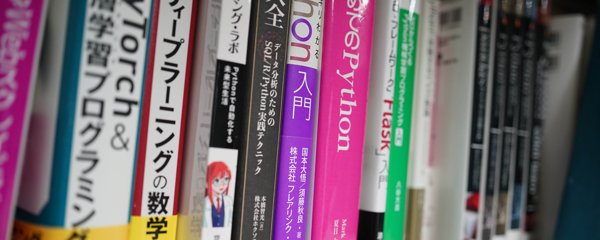
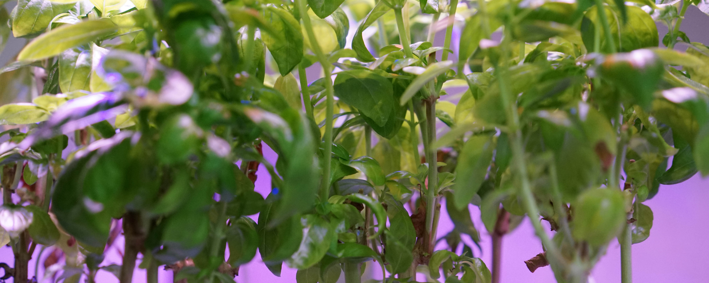

---
#
# By default, content added below the "---" mark will appear in the home page
# between the top bar and the list of recent posts.
# To change the home page layout, edit the _layouts/home.html file.
# See: https://jekyllrb.com/docs/themes/#overriding-theme-defaults
#
layout: home
---

<!-- カルーセルの外枠 -->

  
  
  
    
  
  

    
静岡大学 情報学部 行動情報学科

    
莊司研究室

  

莊司研究室では「人と社会を考慮した情報アクセス技術」の研究室として、
情報検索アプリケーションやWeb情報学、ソーシャルコンピューティングなどの研究を行っています。

研究室の概要、配属希望者向けの情報は[こちら](./about)。

研究プロジェクト、研究テーマは[こちら](./research)。

<h2>最新情報</h2>

<!--  -->